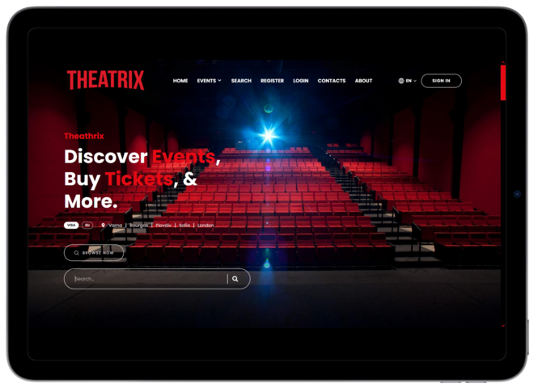
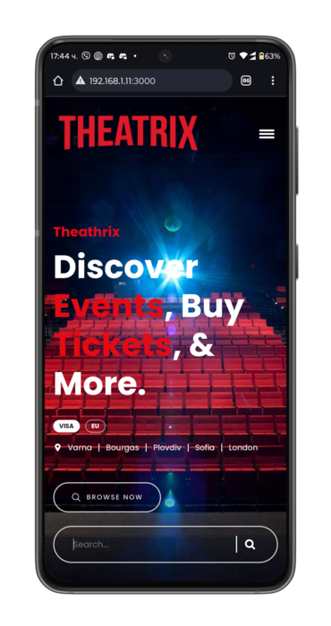

  
  
  
  

   
   
  
  

  <h2 align="center">Theatrix - Netflix Inspired Theater And Concert Events App</h2>
 
   
  
  Theatrix is a Netflix inspired theater and concert event app,  
  
  a playground project build with modern technologies  
  
  Its using my Theatrix-HTML-template as a base  
  
  Fully responsible, built using HTML, CSS and JavaScript.   
 
   

### Screenshots

  
     
     
  
  

  

### Prerequisites

Before you begin, ensure you have met the following requirements:

* [Git](https://git-scm.com/downloads "Download Git") must be installed on your operating system.

 

<figure class="table" style="width:39.37%;">
    <table class="ck-table-resized">
        <colgroup>
            <col style="width:26.39%;">
            <col style="width:23.6%;">
            <col style="width:21.81%;">
            <col style="width:28.2%;">
        </colgroup>
        <thead>
            <tr>
                <th><strong>&nbsp; &nbsp; &nbsp; Permissions</strong></th>
                <th><strong>&nbsp; &nbsp;Guests</strong></th>
                <th><strong>&nbsp; &nbsp; &nbsp;User</strong></th>
                <th><strong>&nbsp; &nbsp; &nbsp; &nbsp;Admin</strong></th>
            </tr>
        </thead>
        <tbody>
            <tr>
                <td>Home</td>
                <td>&nbsp; &nbsp; &nbsp; &nbsp;✔️</td>
                <td>&nbsp; &nbsp; &nbsp; &nbsp; ✔️</td>
                <td>&nbsp; &nbsp; &nbsp; &nbsp; &nbsp; &nbsp;✔️</td>
            </tr>
            <tr>
                <td><i>Personalised Home</i></td>
                <td>&nbsp; &nbsp; &nbsp; &nbsp;❌</td>
                <td>&nbsp; &nbsp; &nbsp; &nbsp; ✔️</td>
                <td>&nbsp; &nbsp; &nbsp; &nbsp; &nbsp; &nbsp;✔️</td>
            </tr>
            <tr>
                <td>Events</td>
                <td>&nbsp; &nbsp; &nbsp; &nbsp;✔️</td>
                <td>&nbsp; &nbsp; &nbsp; &nbsp; ✔️</td>
                <td>&nbsp; &nbsp; &nbsp; &nbsp; &nbsp; &nbsp;✔️</td>
            </tr>
            <tr>
                <td><i>Personalised Events</i></td>
                <td>&nbsp; &nbsp; &nbsp; &nbsp;❌</td>
                <td>&nbsp; &nbsp; &nbsp; &nbsp; ✔️</td>
                <td>&nbsp; &nbsp; &nbsp; &nbsp; &nbsp; &nbsp;✔️</td>
            </tr>
            <tr>
                <td>Theater</td>
                <td>&nbsp; &nbsp; &nbsp; &nbsp;✔️</td>
                <td>&nbsp; &nbsp; &nbsp; &nbsp; ✔️</td>
                <td>&nbsp; &nbsp; &nbsp; &nbsp; &nbsp; &nbsp;✔️</td>
            </tr>
            <tr>
                <td>Concerts</td>
                <td>&nbsp; &nbsp; &nbsp; &nbsp;✔️</td>
                <td>&nbsp; &nbsp; &nbsp; &nbsp; ✔️</td>
                <td>&nbsp; &nbsp; &nbsp; &nbsp; &nbsp; &nbsp;✔️</td>
            </tr>
            <tr>
                <td>About</td>
                <td>&nbsp; &nbsp; &nbsp; &nbsp;✔️</td>
                <td>&nbsp; &nbsp; &nbsp; &nbsp; ✔️</td>
                <td>&nbsp; &nbsp; &nbsp; &nbsp; &nbsp; &nbsp;✔️</td>
            </tr>
            <tr>
                <td>Contacts</td>
                <td>&nbsp; &nbsp; &nbsp; &nbsp;✔️</td>
                <td>&nbsp; &nbsp; &nbsp; &nbsp; ✔️</td>
                <td>&nbsp; &nbsp; &nbsp; &nbsp; &nbsp; &nbsp;✔️</td>
            </tr>
            <tr>
                <td>Login</td>
                <td>&nbsp; &nbsp; &nbsp; &nbsp;✔️</td>
                <td>&nbsp; &nbsp; &nbsp; &nbsp; ❌</td>
                <td>&nbsp; &nbsp; &nbsp; &nbsp; &nbsp; &nbsp;❌</td>
            </tr>
            <tr>
                <td>Register</td>
                <td>&nbsp; &nbsp; &nbsp; &nbsp;✔️</td>
                <td>&nbsp; &nbsp; &nbsp; &nbsp; ❌</td>
                <td>&nbsp; &nbsp; &nbsp; &nbsp; &nbsp; &nbsp;❌</td>
            </tr>
            <tr>
                <td>Details</td>
                <td>&nbsp; &nbsp; &nbsp; &nbsp;✔️</td>
                <td>&nbsp; &nbsp; &nbsp; &nbsp; ✔️</td>
                <td>&nbsp; &nbsp; &nbsp; &nbsp; &nbsp; &nbsp;✔️</td>
            </tr>
            <tr>
                <td>Search</td>
                <td>&nbsp; &nbsp; &nbsp; &nbsp;❌</td>
                <td>&nbsp; &nbsp; &nbsp; &nbsp; ✔️</td>
                <td>&nbsp; &nbsp; &nbsp; &nbsp; &nbsp; &nbsp;✔️</td>
            </tr>
            <tr>
                <td>Profile</td>
                <td>&nbsp; &nbsp; &nbsp; &nbsp;❌</td>
                <td>&nbsp; &nbsp; &nbsp; &nbsp; ✔️</td>
                <td>&nbsp; &nbsp; &nbsp; &nbsp; &nbsp; &nbsp; ❌</td>
            </tr>
            <tr>
                <td>Buy Tickets</td>
                <td>&nbsp; &nbsp; &nbsp; &nbsp;❌</td>
                <td>&nbsp; &nbsp; &nbsp; &nbsp; ✔️</td>
                <td>&nbsp; &nbsp; &nbsp; &nbsp; &nbsp; &nbsp; ❌</td>
            </tr>
            <tr>
                <td>Pin Events</td>
                <td>&nbsp; &nbsp; &nbsp; &nbsp;❌</td>
                <td>&nbsp; &nbsp; &nbsp; &nbsp; ❌</td>
                <td>&nbsp; &nbsp; &nbsp; &nbsp; &nbsp; &nbsp; ✔️</td>
            </tr>
            <tr>
                <td>Like Events</td>
                <td>&nbsp; &nbsp; &nbsp; &nbsp;❌</td>
                <td>&nbsp; &nbsp; &nbsp; &nbsp; ✔️</td>
                <td>&nbsp; &nbsp; &nbsp; &nbsp; &nbsp; &nbsp; ❌</td>
            </tr>
            <tr>
                <td>Add Events</td>
                <td>&nbsp; &nbsp; &nbsp; &nbsp;❌</td>
                <td>&nbsp; &nbsp; &nbsp; &nbsp; ❌</td>
                <td>&nbsp; &nbsp; &nbsp; &nbsp; &nbsp; &nbsp; ✔️</td>
            </tr>
            <tr>
                <td>Edit Events</td>
                <td>&nbsp; &nbsp; &nbsp; &nbsp;❌</td>
                <td>&nbsp; &nbsp; &nbsp; &nbsp; ❌</td>
                <td>&nbsp; &nbsp; &nbsp; &nbsp; &nbsp; &nbsp; ✔️</td>
            </tr>
            <tr>
                <td>Delete Events</td>
                <td>&nbsp; &nbsp; &nbsp; &nbsp;❌</td>
                <td>&nbsp; &nbsp; &nbsp; &nbsp; ❌</td>
                <td>&nbsp; &nbsp; &nbsp; &nbsp; &nbsp; &nbsp; ✔️</td>
            </tr>
        </tbody>
    </table>
</figure>

 

### Notes

<h2>Registering from external ip makes you User***</h2>

<h2>Registering from -- 127.0.0.1-- makes you Admin***</h2>

 

### License
Free. Just dont pretend that the author is you.

